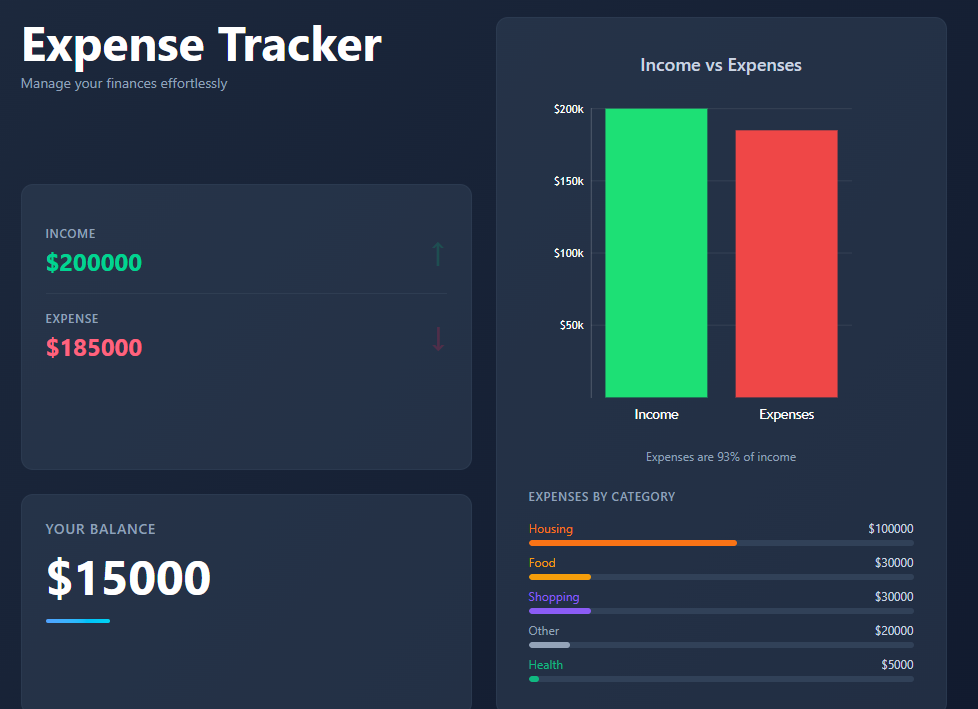

# Expense Tracker

A personal finance tracker built with React that lets you manage income and expenses with category breakdowns and visual charts.

## Features

- Add income and expense transactions with categories
- Real-time balance, income, and expense totals
- Bar chart comparing total income vs expenses
- Expense breakdown by category with progress bars
- Filter transaction history by category
- Data persisted in localStorage

## Tech Stack

- React 18
- Vite
- Tailwind CSS
- Victory (charts)
- Context API + useReducer

## Getting Started

```bash
npm install
npm run dev
```

## Screenshots


